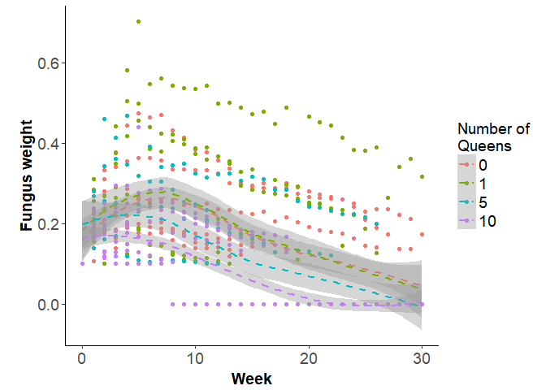

# Ant_GrowthCurve
Oscar Feng-Hsun Chang  
2017 Nov. 30  


```r
ifelse(!require(lavaan), install.packages("lavaan"), library(lavaan))
```

```
## Warning: package 'lavaan' was built under R version 3.4.2
```

```
## [1] "lavaan"
```

```r
library(lavaan)

ifelse(!require(MASS), install.packages("MASS"), library(MASS))
```

```
## [1] "MASS"
```

```r
library(MASS)

ifelse(!require(faraway), install.packages("faraway"), library(faraway))
```

```
## [1] "faraway"
```

```r
library(faraway)

ifelse(!require(lme4), install.packages("lme4"), library(lme4))
```

```
## [1] "lme4"
```

```r
library(lme4)

ifelse(!require(nlme), install.packages("nlme"), library(nlme))
```

```
## [1] "nlme"
```

```r
library(nlme)

ifelse(!require(ggplot2), install.packages("ggplot2"), library(ggplot2))
```

```
## [1] "ggplot2"
```

```r
library(ggplot2)

ifelse(!require(plyr), install.packages("plyr"), library(plyr))
```

```
## [1] "plyr"
```

```r
library(plyr)

ifelse(!require(magrittr), install.packages("magrittr"), library(magrittr))
```

```
## [1] "magrittr"
```

```r
library(magrittr)

ifelse(!require(reshape2), install.packages("reshape2"), library(reshape2))
```

```
## [1] "reshape2"
```

```r
library(reshape2)

ifelse(!require(cowplot), install.packages("cowplot"), library(cowplot))
```

```
## [1] "cowplot"
```

```r
library(cowplot)

ifelse(!require(vegan), install.packages("vegan"), library(vegan))
```

```
## Warning: package 'vegan' was built under R version 3.4.2
```

```
## Warning: package 'permute' was built under R version 3.4.2
```

```
## [1] "vegan"
```

```r
library(vegan)
```


```r
dat.raw %>%
  ggplot() + 
  geom_point(aes(x=week, y=fungus, color=factor(queen)))+
  geom_smooth(aes(x=week, y=fungus, color=factor(queen)), method="loess", linetype=2)+ 
  labs(x="Week", 
       y="Fungus weight")+ 
  scale_colour_discrete(name="Number of \nQueens")+
  theme_bw() +
  theme(panel.border = element_blank(), 
        panel.grid.major = element_blank(), 
        panel.grid.minor = element_blank(), 
        axis.line = element_line(colour = "black"), 
        axis.text=element_text(size=14), 
        axis.title.x=element_text(size=14, face="bold", margin=margin(t = 8, r = 0, b = 0, l = 0)),
        axis.title.y=element_text(size=14, face="bold", margin=margin(t = 0, r = 4, b = 0, l = 12)),
        legend.key=element_rect(color="white", fill="white"), 
        legend.title=element_text(size=14),
        legend.text=element_text(size=14),
        legend.background=element_rect(),
        plot.caption=element_text(size=8, hjust=1, margin=margin(t = 12, r = 20, b = 0, l = 0)))
```

<!-- -->


```r
dat = dat.raw %>%
  mutate(month = (week-1)%/%4 + 1) %>%
  ddply(c("trmt", "month"), summarize,
        fung = mean(fungus),
        queen = mean(queen))

dat.mo = as.data.frame(matrix(0, length(unique(dat[,"trmt"])), (length(unique(dat[,"month"])))+1))
for (i in 1:length(unique(dat[,"trmt"]))){
  dat.mo[i,1] = dat[which(dat[,"trmt"]==unique(dat[,"trmt"])[i]),"queen"][1]
  dat.mo[i,-1] = dat[which(dat[,"trmt"]==unique(dat[,"trmt"])[i]),"fung"]
}
colnames(dat.mo) = c("queen", paste0("t", unique(dat[,"month"])))

mod.lm = 
'
  i =~ 1*t1 + 1*t2 + 1*t3 + 1*t4 + 1*t5 + 1*t6 + 1*t7 + 1*t8
  s =~ 1*t1 + 2*t2 + 3*t3 + 4*t4 + 5*t5 + 6*t6 + 7*t7 + 8*t8 
'

fit = growth(mod.lm, 
             data=dat.mo)
```

```
## Warning in lav_object_post_check(object): lavaan WARNING: some estimated ov
## variances are negative
```

```r
             # group = "queen")
             # When estimating coefficients for each group, replicate are too few to estimate such long time series...
summary(fit)
```

```
## lavaan (0.5-23.1097) converged normally after 131 iterations
## 
##   Number of observations                            26
## 
##   Estimator                                         ML
##   Minimum Function Test Statistic              172.200
##   Degrees of freedom                                31
##   P-value (Chi-square)                           0.000
## 
## Parameter Estimates:
## 
##   Information                                 Expected
##   Standard Errors                             Standard
## 
## Latent Variables:
##                    Estimate  Std.Err  z-value  P(>|z|)
##   i =~                                                
##     t1                1.000                           
##     t2                1.000                           
##     t3                1.000                           
##     t4                1.000                           
##     t5                1.000                           
##     t6                1.000                           
##     t7                1.000                           
##     t8                1.000                           
##   s =~                                                
##     t1                1.000                           
##     t2                2.000                           
##     t3                3.000                           
##     t4                4.000                           
##     t5                5.000                           
##     t6                6.000                           
##     t7                7.000                           
##     t8                8.000                           
## 
## Covariances:
##                    Estimate  Std.Err  z-value  P(>|z|)
##   i ~~                                                
##     s                -0.001    0.000   -2.768    0.006
## 
## Intercepts:
##                    Estimate  Std.Err  z-value  P(>|z|)
##    .t1                0.000                           
##    .t2                0.000                           
##    .t3                0.000                           
##    .t4                0.000                           
##    .t5                0.000                           
##    .t6                0.000                           
##    .t7                0.000                           
##    .t8                0.000                           
##     i                 0.262    0.016   16.655    0.000
##     s                -0.031    0.003   -9.623    0.000
## 
## Variances:
##                    Estimate  Std.Err  z-value  P(>|z|)
##    .t1               -0.000    0.001   -0.336    0.737
##    .t2                0.010    0.003    3.558    0.000
##    .t3                0.011    0.003    3.598    0.000
##    .t4                0.012    0.003    3.599    0.000
##    .t5                0.011    0.003    3.577    0.000
##    .t6                0.006    0.002    3.499    0.000
##    .t7                0.000    0.000    0.729    0.466
##    .t8                0.002    0.001    2.390    0.017
##     i                 0.007    0.002    3.077    0.002
##     s                 0.000    0.000    3.406    0.001
```


If I wish to compute an integral $\int\!h(x)\,f(x)\,dx$, where $h$ is integrable and $f$ is a probability distribution function, I can recast this as an expectation and use the fundamental Monte Carlo theorem:
$$\int\!h(x)\,f(x)\,dx = \mathbb{E}[h(X)] \approx \overline{h}_N = \frac{1}{N}\,\sum_{i=1}^N\!h(X_i), \quad \text{where} \quad X_i \stackrel{iid}{\sim} f.$$
The error in this approximation is just the standard error on the mean:
$$\mathbb{E}\left[(\overline{h}_N-\mathbb{E}[h(X)])^2\right] = \frac{1}{N}\,\mathrm{Var}[h(X)] \approx \frac{v_N}{N}, \quad \text{where} \quad v_N = \frac{1}{N-1}\,\sum_{i=1}^N\!(h(X_i)-\overline{h}_N)^2.$$ 
Because the error goes down as $1/\sqrt{N}$, we have increase the number of Monte Carlo replicates by a factor of 4 to cut the error in half.


